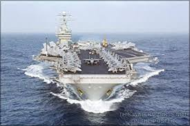
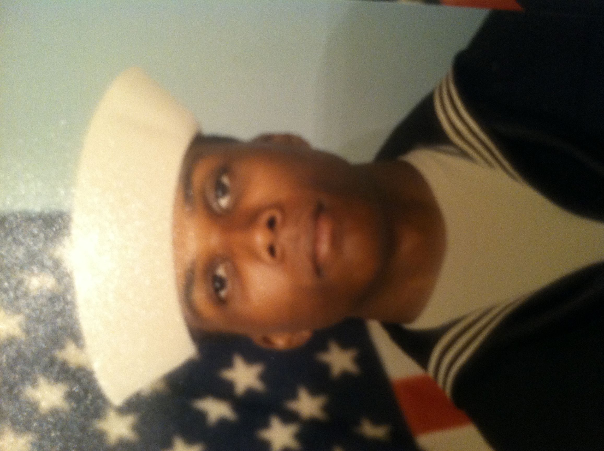

  <head>
    
    <link rel='stylesheet' href='styles.css'/>
    
    
      
      </head>
      
    
<h2> ERIC MOORE </h2>

  

  I'm a Navy veteran from the USS Dwight D. Eisenhower aircraft carrier. I've traveled to many ports of call in the Mediterean sea. After moving back to my home South Carolina I completed my bachelors in Business and wanted to pursue my MBA ,but realized that higher education doesn't always land you the job you would like. So wanting a flexible schedule I decided to pursue my real estate license. I'm looking for a chance to learn how to create web pages that can give the browser a excellent experience. CLEMSON TIGER FAN. 

  
  

 
 
 
 
 
 <footer>
 
 <a href="https://www.facebook.com/profile.php?id=100004934805998">
 
 <a href="https://www.twitter.com/emoorehomes">
  
  </footer>
  
  
  
  
  
  
 
 
 
 
 
 
 
 
 
 
 
 
 

 
 
 
 
 
 
 
 

 
 
 
 
 
 
 
 
 
 
 
 
 
 
 
 
 
 
 
 
 
 
 
 

 
 
 

 
 
 
 
 
 
 
 

                                                                

                                                                           

